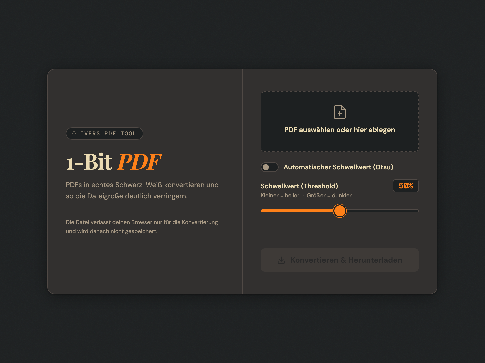
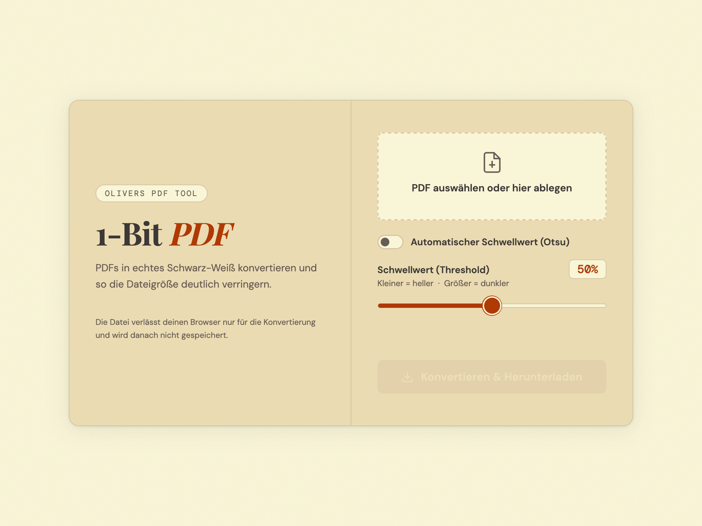

# 1-Bit-PDF 📄🚀

Ein schlankes Web-Tool, um große PDF-Scans in extrem kompakte Schwarz-Weiß-PDFs (1-Bit) zu konvertieren.
Ideal, um Speicherplatz zu sparen und die Lesbarkeit von Dokumenten zu erhöhen.

Dark Mode

Light Mode

## ✨ Features
- **Echtes 1-Bit Schwarz-Weiß:** Nutzt TIFF Group-4-Kompression innerhalb des PDFs.
- **Intelligente Binarisierung:** Wahlweise manueller Schwellwert oder automatischer **Otsu-Algorithmus**.
- **Text-Optimierung:** Integrierte *Unsharp Mask*, um dünne Linien beim Binarisieren zu erhalten.
- **Schnell:** Multi-threaded Verarbeitung der PDF-Seiten für maximale Performance.
- **Privatsphäre:** Die Verarbeitung erfolgt temporär; Dateien werden nach dem Download gelöscht.

## 🛠 Technologie
1-Bit-PDF nutzt:
- **Python / Flask** (Backend)
- **PyMuPDF (fitz)** (PDF-Verarbeitung)
- **Pillow** (Bildmanipulation)
- **Numpy** (Mathematische Berechnungen für Otsu)

## 🚀 Installation & Start
Diese Anwendung wurde für den Betrieb mit Docker Compose auf OpenMediaVault entwickelt.

1. Repository klonen oder Dateien manuell herunterladen.
2. 1-Bit-PDF in Docker Compose anlegen.
3. Dockerfile, index.html, app.py und requirements.txt im 1-Bit-PDF-Compose-Ordner ablegen.
4. Container starten.
5. Das Tool ist nun unter DEINE.SERVER.IP:4040 erreichbar.

## 🤖 Disclaimer
> Dieses Projekt wurde mit Hilfe von KI erstellt.
